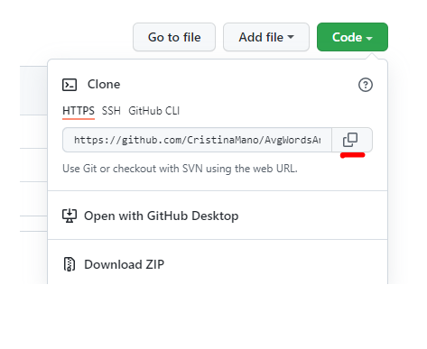
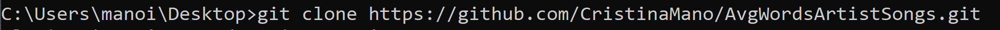
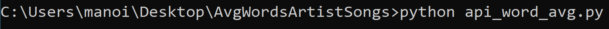
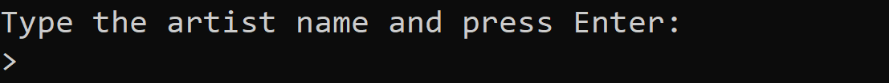
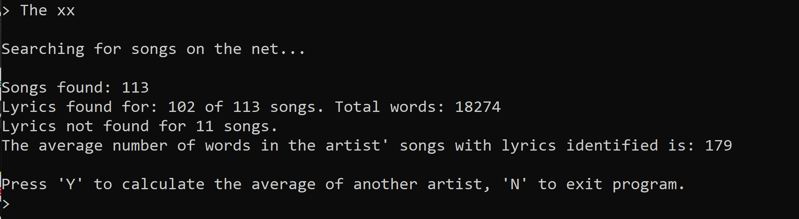
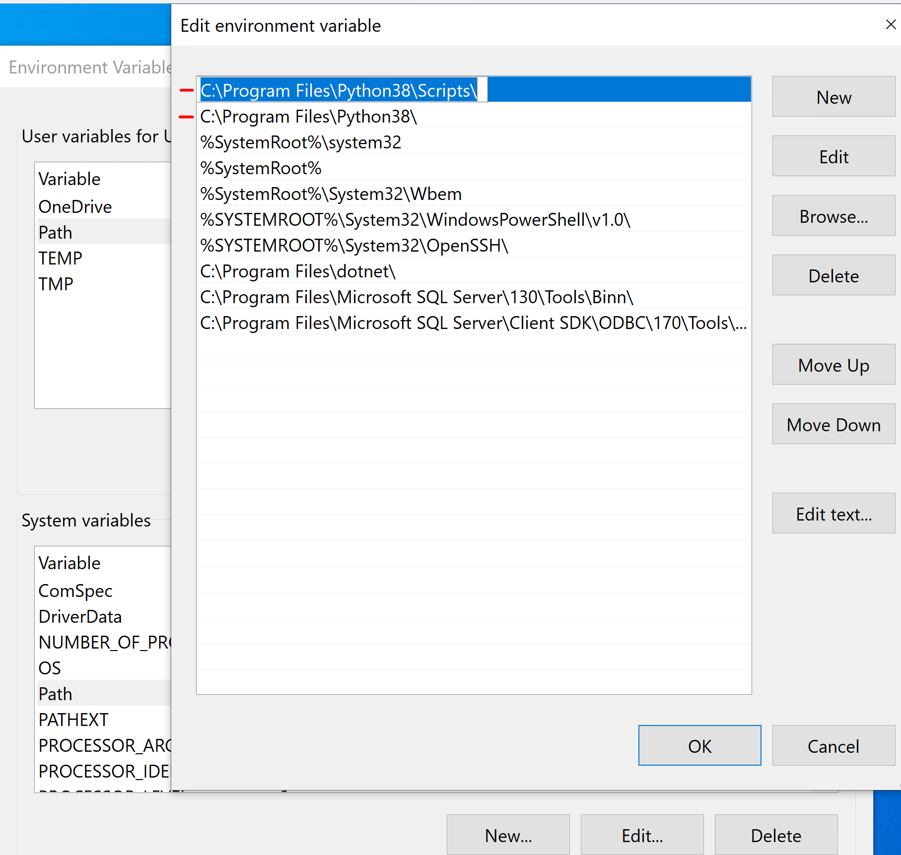

# AvgWordsArtistSongs
## **Introduction**
This project provides the average number of words given the name of an artist. 
Two APIs are used for calculating the average number of words:
1) [MusicBrainz](https://musicbrainz.org/doc/MusicBrainz_API);
2) [Lyricsovh](https://lyricsovh.docs.apiary.io/#reference).

## **Prerequisite**
This project is created on Windows 10 with:
- python 3.8.5

In order to run the script install the following: 
- **pip install requests** --> otherwise a module error will raise ("ModuleNotFoundError: No module named 'requests'")
- **pip install musicbrainzngs** --> otherwise "ModuleNotFoundError: No module named 'musicbrainzngs'" will raise
- **pip install pandas** --> otherwise "ModuleNotFoundError: No module named 'pandas'" will raise

## **Steps to run the repo**
Further, clone the repository by following the next steps:
1) Click on "Code" and copy the HTTPS (you should copy https://github.com/CristinaMano/AvgWordsArtistSongs.git)

2) Using cmd write: "git clone https://github.com/CristinaMano/AvgWordsArtistSongs.git". Now a repository will be saved on your machine, in the specified directory (on Desktop in my case). 

3) A folder will be created on your Desktop. To open the script just chance the directory (AvgWordsArtistSongs) and type: python api_word_avg.py.   

4) By hitting "Enter" the program will run :slightly_smiling_face:. 
    --> You can now type an artist name so you can get the average number of words in the artist' songs:

--> I pick "The xx" but you can also try by typing other artists and get the average (mean). At the end, the program will ask if you want to try another artist or to exit the program.

    I now encourage you to try playing with it :grinning:.

## **Notes**
If you've never used python:
- install it from the [official site](https://www.python.org/downloads/) and double-check if the python path is added to System Environment Variables (Advanced-> Environment Variables-> Path (System variables)) along with its pip path. If they've been added, it should look like:

Note that the sys and time are installed when installing Python itself.

## **Contact**
Thank you

Cristina Manoila
https://github.com/CristinaMano/AvgWordsArtistSongs
